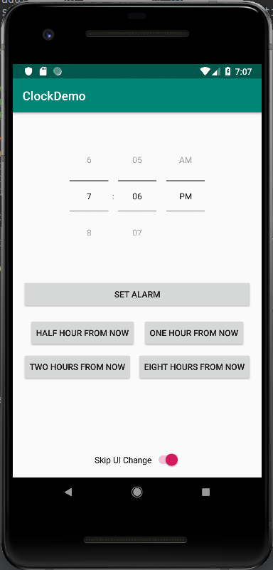

# Alarm Clock Tutorial
_By Evan Duffy and Ben Newmark_

In this tutorial, you will learn how to make a simple app to set alarms for one of a few preset times as well as a custom time that can be set within the app.

---

# Step 1: Create The UI
First, we need to whip up a simple UI for our app. You should already be familiar with this process from previous projects, but this UI has an element in it that is not in the WYSIWYG editor.

This is what we will be going for:



To create the time setter, we need to add a bit of xml directly to the top of the `activity_main.xml` file:

```xml
    <TimePicker
        android:layout_width="wrap_content"
        android:layout_height="wrap_content"
        android:timePickerMode="spinner" />
```
This will place the `TimePicker` and we can now work with it in the WYSIWYG eitor. After getting the `TimePicker` the way you want it, add the buttons and the switch.

We will discuss what these buttons will do in future sections.

---

# Step 2: Setting Alarms With The Android API

Setting alarms from the Android API is actually quite easy. All that is needed is to run an intents with a few parameters. 

First we need to get permission to set alarms from the Android API. Add the following line to your AndroidManifest.xml at the same level as (not under) the `application` tag:
```xml
<uses-permission android:name="com.android.alarm.permission.SET_ALARM" />
```

The intent needed is called `AlarmClock.ACTION_SET_ALARM`. Running this intent without parameters will bring up a system dialogue where the user can set an alarm, but we would like our app to set the alarm itself. 

To specify the time to set the alarm, we need to add extras to the intent as parameters. 
Use the following function when setting the time:

```java
    /**
     * Set an alarm for a given time
     * @param hour The hour for the alarm
     * @param minute The minute for the alarm
     */
    private void setAlarm(int hour, int minute) {
        Intent createAlarmIntent = new Intent(AlarmClock.ACTION_SET_ALARM);
        createAlarmIntent.putExtra(AlarmClock.EXTRA_HOUR, hour);
        createAlarmIntent.putExtra(AlarmClock.EXTRA_MINUTES, minute);
        createAlarmIntent.putExtra(AlarmClock.EXTRA_MESSAGE,  "Demo Alarm " + this.alarm_index++);

        Switch toggle = findViewById(R.id.switch1);

        createAlarmIntent.putExtra(AlarmClock.EXTRA_SKIP_UI, toggle.isChecked());

        getApplicationContext().startActivity(createAlarmIntent);
    }
```
This will set the alarm based on the parameters and set the message for the alarm to `Demo Alarm [n]` where [n] is the number of the alarm (this should be set by you previously).
Also, note the line: `createAlarmIntent.putExtra(AlarmClock.EXTRA_SKIP_UI,toggle.isChecked())`. This line will ensure that the Clock UI will be brought up only if the setting to skip, which is pulled from the toggle switch, is false. 

# Step 3: OnClick Handlers

You may have noticed that the buttons don't do anything right now. We will now go over the handlers that will be calling the above function when the buttons are clicked.

## Set Alarm For A Preset Time Relative To Current Time
The following code is an example function of a button handler. Replace `{{Hours}}` with the desired number of hours from the current time to set the alarm for that time. If you are doing less than an hour, use `Calendar.MINUTE` and specify the number of minutes.
```java
    public void onClickExample(View v) {
        Calendar time = Calendar.getInstance();
        time.setTime(new Date()); // Set the time to now
        time.add(Calendar.HOUR, {{Hours}});
        this.setAlarm(time.get(Calendar.HOUR_OF_DAY), time.get(Calendar.MINUTE));
    }

```

## Set Alarm For Custom Time
The following code will set an alarm for the time displayed on the `TimePicker`:
```java
    public void onTPClick(View v) {
        TimePicker alarmTP = findViewById(R.id.timePicker);
        this.setAlarm(alarmTP.getHour(), alarmTP.getMinute());
    }
```